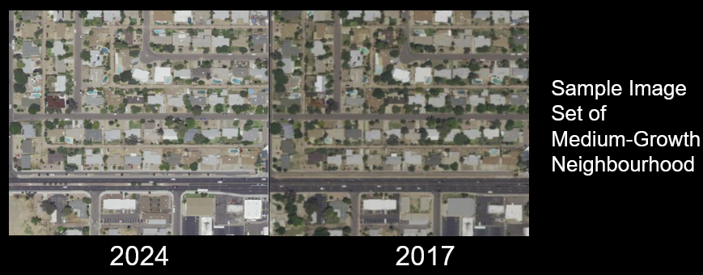

We're excited to announce that this project won Third Place at Georgia Tech's Hacklytics 2024 in the FinTech Track and also Third Place [@Intel's](https://pages.github.com/](https://github.com/intel)) Best Use of Intel Developer Cloud challenge!

- 🥉 Best Use of Intel Developer Cloud
- 🥉 FinTech Track
- $2200 in prizes

@GeorgiaTech Hacklytics2024

____________________________________________________________________________________________________________________________________________________________________________________

# EstateEdge

In every pixel of satellite imagery lies a story waiting to be told. A narrative of transformation, expansion, and possibilities unfolds with each pixel. EstateEdge endeavours to bring forth these narratives, enabling you to engage with the tale of progress and prosperity. It's not just about investments; it's about empowering you to make informed decisions that align with your vision for a brighter tomorrow.

Above is our main website concept. 

Our program prompts users to input a city, and we then gather satellite data, including past and present images. Our program utilizes a machine learning algorithm which compares the images, and from there utilizes an algorithm which determines a "score" relative to past training data in how well it is expected to grow in price. A higher score (typically above 50%) means a higher chance of price growth shortly, and thus a good investment opportunity. 

Here is an example of two sample aerial images being compared:

We also have a feature called "getRecommendations" that retrieves information on neighbouring towns/cities and outputs what the algorithm believes to be the best investment in the local area. 

We believe these two applications are only the stepping stone of the program, and this program has the potential to evolve in many more directions. Our group explored potential avenues in combining various other datasets including economic trends, and crime rates, in hopes to provide more analytic data to users to make more informed decisions. We were also hoping to get a leaderboard of the best global investment opportunities.

Thank you for reading about our project!

-Rini, Nick, Anant, Thomas

Acknowledgements

This project utilizes models and code developed by Bob Chesebrough and Professor Q.Wu, which have significantly contributed to the functionality and performance of our application. We extend our gratitude for their support and resources.

Geemap is created by Professor Q.Wu at https://geemap.org/

Wu, Q., (2020). geemap: A Python package for interactive mapping with Google Earth Engine. The Journal of Open Source Software, 5(51), 2305. https://doi.org/10.21105/joss.02305
Wu, Q., Lane, C. R., Li, X., Zhao, K., Zhou, Y., Clinton, N., DeVries, B., Golden, H. E., & Lang, M. W. (2019). Integrating LiDAR data and multi-temporal aerial imagery to map wetland inundation dynamics using Google Earth Engine. Remote Sensing of Environment, 228, 1-13. https://doi.org/10.1016/j.rse.2019.04.015 

Citation
- Sponsor/Developer Name: [Bob Chesebrough]
- Model/Code Name: [IntelSoftware Jurassic]
- Source: [https://github.com/IntelSoftware/Jurassic]
- Usage: [We utilized a similar machine learning algorithm used in the following program, and took inspiration behind much of the model processes. ]

